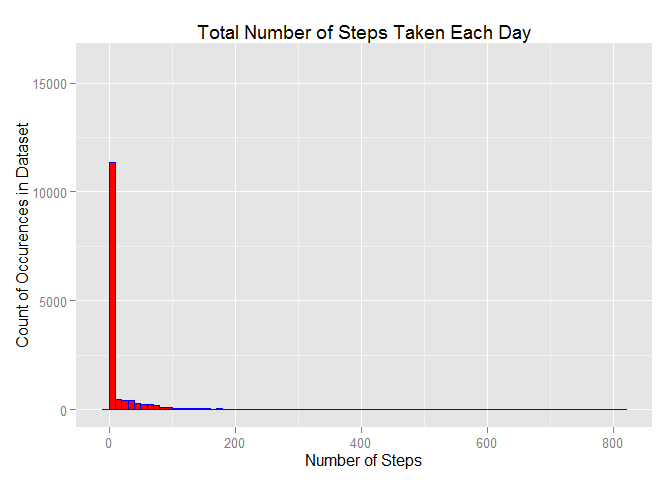
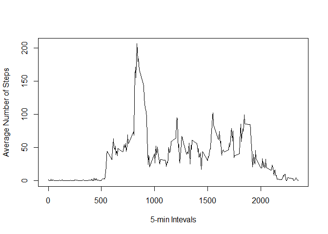
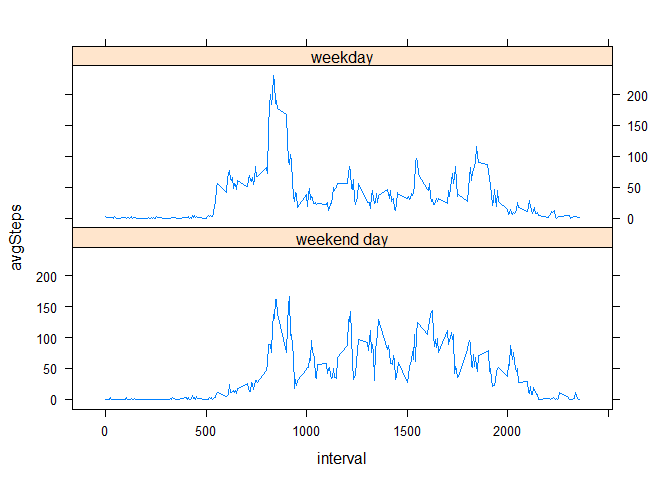

# Reproducible Research: Peer Assessment 1


## Loading and preprocessing the data
#### The part of this assignment includes tasks such as downloading, unzipping and reading the dataset into a dataframe. I chose to eliminate the missing values (marked as NA) from the beginning as preparation for data processing. The code used for loading and the preprocessing is included below:

```r
library(dplyr)
```

```
## Warning: package 'dplyr' was built under R version 3.2.3
```

```r
library(ggplot2)
filename <- "repdata_data_activity.zip"

## Download and unzip the dataset:
if (!file.exists(filename)){
  fileURL <- "https://d396qusza40orc.cloudfront.net/repdata%2Fdata%2Factivity.zip"
  download.file(fileURL, filename)
}  
if (!file.exists("activity.csv")) { 
  unzip(filename) 
}

##1.Code for reading in the dataset and/or processing the data
mainData <- na.omit(read.csv("activity.csv"))

#Convert the date variable to R class (POSIXlt)
mainData$date <- as.Date(mainData$date, "%Y-%m-%d")
```

## What is mean total number of steps taken per day?
#### As a first step in the exploratory analysis a histogram of daily steps was generated to understand the distribution of data. 

#### The code and the plot are presented below:

```r
qplot(mainData$steps, geom="histogram",
      binwidth = 10,
      main = "Total Number of Steps Taken Each Day",
      ylab = "Count of Occurences in Dataset",
      xlab = "Number of Steps", fill=I("red"), col=I("blue"), ylim = c(0, 16000))
```

\


#### As observed in the above histogram, the dataset is highly skewed towards 0 daily steps.
#### The summary () function from dplyr was used to determine the mean and median of the total daily steps:
#### Min. 1st Qu.  **Median**    **Mean** 3rd Qu.    Max.
<pre>
0.00 0.00   0.00   37.38   12.00   806.00  
</pre>

#### The median value confirms the histogram results that data is heavily distributed around 0 daily steps fopr this dataset. 

## What is the average daily activity pattern?
#### A time-series plot of the average number of steps was generated to understand the daily activity patterns.
#### The averages were generated by grouping the data by the standard 5-min intervals using group_by() dpyr function.
#### Averages for each interval were considered across all days.

#### The code and the plot used are included below:

```r
##4.Time series plot of the average number of steps taken per 5-minute interval
stepIntervals <- group_by(mainData, interval) %>%
              summarize(avgSteps = mean(steps))

#Create the time plot 
with(stepIntervals, {
  plot(interval, avgSteps, type = "l", 
       ylab = "Average Number of Steps",
       xlab = "5-min Intevals")
})
```

\


#### The 5-minute interval, that contains the maximum number of steps, on average across all days was also calculated.That is interval 835 with the average steps of 206.17, as can be also observed in the above time-series plot. 


## Imputing missing values
#### Missing values may represent a problem if they represent a fairly large percentage of the overall dataset.
#### For the current dataset, the missing values represent less than 5%, namely 4.4%, so it may not represent such a potential problem 

#### The missing values have been replaced in order to test the above hypothesis. The mean of the corresponding 5-min interval was used as the replacement values:


```r
imputData <- group_by(mainData, interval) %>%
          mutate(steps = replace(steps, is.na(steps), mean(steps, na.rm = TRUE)))
```

#### Histograms of the averaged numbers of steps were generated to compare the impact of imputting the missing values:

image: 

#### It can be observed that the majority of the missing values were replaced with the 0s corresponding to the average of the corresponding 5-min intervals. This is expected since the mean of the dataset is 0.

#### The difference between imputted and initial dataset is also reflected below:

```r
mainData <- read.csv("activity.csv")
imputData <- group_by(mainData, interval) %>%
          mutate(steps = replace(steps, is.na(steps), mean(steps, na.rm = TRUE)))

imputData <- as.data.frame(imputData)
imputData$steps <- as.integer(imputData$steps)


cat("Summary for IMPUTTED dataset:", "\n")  
```

```
## Summary for IMPUTTED dataset:
```

```r
print(summary(imputData$steps))
```

```
##    Min. 1st Qu.  Median    Mean 3rd Qu.    Max. 
##    0.00    0.00    0.00   37.33   27.00  806.00
```

```r
cat("Summary for INITIAL dataset:", "\n")  
```

```
## Summary for INITIAL dataset:
```

```r
print(summary(mainData$steps))
```

```
##    Min. 1st Qu.  Median    Mean 3rd Qu.    Max.    NA's 
##    0.00    0.00    0.00   37.38   12.00  806.00    2304
```

#### It can be observed that the difference between the mean and median of the two dataset is minimal, but the 3rd quantiles are different.

## Are there differences in activity patterns between weekdays and weekends?
#### Two factors have been created to determine the pattern differences between weekdays and weekend days:

```r
#Convert the date variable to R class (POSIXlt) and create factor
imputData$date <- as.Date(imputData$date, "%Y-%m-%d")
weekend <- c("Saturday", "Sunday")
dayVar <- factor((weekdays(imputData$date) %in% weekend), 
                    levels = c(TRUE, FALSE), 
                    labels = c("weekend day", "weekday"))

##Add the variable to dataset and average steps by day type
imputData <- mutate(imputData, daytype = dayVar)
stepsImput <- group_by(imputData, interval, daytype) %>%
  summarize(avgSteps = mean(steps))

library(lattice)
xyplot(avgSteps ~ interval | daytype, data = stepsImput, type = "l", layout = c(1, 2))
```

\


#### The time series plots indicate that more activity during the weekend. The maximum number of steps occurs around the same 5-min interval (800), both during the weekend and week, with a bit higher maximum during the week.
